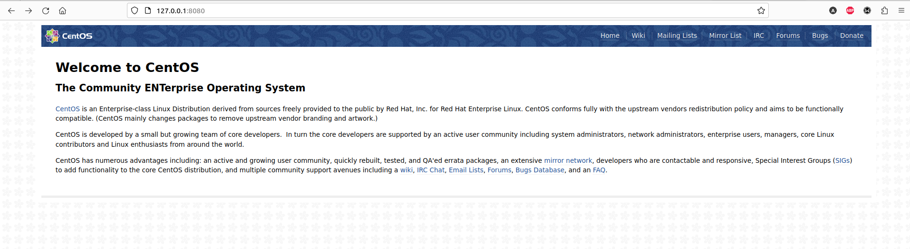

# Фильтрация трафика - firewalld, iptables 
Для выполнения этого действия требуется установить приложением git:
`git clone https://github.com/altyn-kenzhebaev/firewall-hw20.git`
В текущей директории появится папка с именем репозитория. В данном случае network-hw18. Ознакомимся с содержимым:
```
cd firewall-hw20
ls -l
README.md
ansible
Vagrantfile
```
Здесь:
- ansible - папка с плэйбуками
- README.md - файл с данным руководством
- Vagrantfile - файл описывающий виртуальную инфраструктуру для `Vagrant`
Запускаем ВМ:
```
vagrant up
```

## Реализовать knocking port
Сначала нужно установить пакет, настроить и запустить knock-server:
```
  - name: Stop and disable Firewalld
    systemd:
      name: firewalld
      state: stopped
      enabled: false

  - name: Install iptables
    yum:
      name:
      - iptables
      - iptables-services
      state: present
      update_cache: true
      
  - name: Install EPEL
    yum:
      name:
      - epel-release
      state: present
      update_cache: true

  - name: Install Knock Server
    yum:
      name:
      - knock-server
      state: present
      update_cache: true

  - name: Copy knockd config
    copy:
      dest: /etc/knockd.conf
      src: knockd.conf
      owner: root
      group: root
      mode: 0640
    
  - name: Start Knock Server
    systemd:
      name: knockd
      enabled: true
      state: started
$ cat /etc/knockd.conf
[options]
        UseSyslog

[opencloseSSH]
        sequence      = 8881:tcp,7777:tcp,9991:tcp
        seq_timeout   = 15
        tcpflags      = syn,ack
        start_command = /sbin/iptables -A INPUT -s %IP% -p tcp --dport ssh -j ACCEPT
        cmd_timeout   = 10
        stop_command  = /sbin/iptables -D INPUT -s %IP% -p tcp --dport ssh -j ACCEPT
```
Затем добавляем конфигурацию iptables и добавляем настройки и маршруты:
```
  - name: Copy iptables config
    copy:
      dest: /etc/sysconfig/iptables
      src: iptables
      owner: root
      group: root
      mode: 0600

  - name: Start and enable iptables
    systemd:
      name: iptables
      state: restarted
      enabled: true

  - name: Set up route on inetRouter1 eth1
    copy:
      dest: /etc/sysconfig/network-scripts/route-eth1
      src: inetRouter_route_eth1
      owner: root
      group: root
      mode: 0644

  - name: Set up forward packages across routers
    sysctl:
      name: net.ipv4.conf.all.forwarding
      value: '1'
      state: present

  - name: Reboot to apply network routes
    ansible.builtin.reboot:
$ cat /etc/sysconfig/iptables
*filter
:INPUT DROP [0:0]
:FORWARD ACCEPT [0:0]
:OUTPUT ACCEPT [0:0]
-A INPUT -m state --state RELATED,ESTABLISHED -j ACCEPT
-A INPUT -i lo -j ACCEPT
-A INPUT -i eth0 -p tcp --dport 22 -m conntrack --ctstate NEW,ESTABLISHED -j ACCEPT
-A OUTPUT -p tcp --sport 22 -m conntrack --ctstate ESTABLISHED -j ACCEPT
:TRAFFIC - [0:0]
:SSH-INPUT - [0:0]
:SSH-INPUTTWO - [0:0]
# TRAFFIC chain for Port Knocking. The correct port sequence in this example is  8881 -> 7777 -> 9991; any other sequence will drop the traffic
-A INPUT -j TRAFFIC
-A TRAFFIC -p icmp --icmp-type any -j ACCEPT
-A TRAFFIC -m state --state ESTABLISHED,RELATED -j ACCEPT
-A TRAFFIC -m state --state NEW -m tcp -p tcp --dport 22 -m recent --rcheck --seconds 30 --name SSH2 -j ACCEPT
-A TRAFFIC -m state --state NEW -m tcp -p tcp -m recent --name SSH2 --remove -j DROP
-A TRAFFIC -m state --state NEW -m tcp -p tcp --dport 9991 -m recent --rcheck --name SSH1 -j SSH-INPUTTWO
-A TRAFFIC -m state --state NEW -m tcp -p tcp -m recent --name SSH1 --remove -j DROP
-A TRAFFIC -m state --state NEW -m tcp -p tcp --dport 7777 -m recent --rcheck --name SSH0 -j SSH-INPUT
-A TRAFFIC -m state --state NEW -m tcp -p tcp -m recent --name SSH0 --remove -j DROP
-A TRAFFIC -m state --state NEW -m tcp -p tcp --dport 8881 -m recent --name SSH0 --set -j DROP
-A SSH-INPUT -m recent --name SSH1 --set -j DROP
-A SSH-INPUTTWO -m recent --name SSH2 --set -j DROP
-A TRAFFIC -j DROP
COMMIT
*nat
:PREROUTING ACCEPT [1:161]
:INPUT ACCEPT [0:0]
:OUTPUT ACCEPT [0:0]
:POSTROUTING ACCEPT [0:0]
-A POSTROUTING ! -d 192.168.0.0/16 -o eth0 -j MASQUERADE
COMMIT
```
## Проверка knocking port
Заходим переходим к пользователю root сервера centralRouter:
```
vagrant ssh centralRouter
sudo -i
```
Устанавливаем nmap и создаем скрипт клиента:
```
$ yum install nmap -y
$ vi knock
#!/bin/bash
HOST=$1
shift
for ARG in "$@"
do
        nmap -Pn --host-timeout 100 --max-retries 0 -p $ARG $HOST
done
```
Добавляем private_key с настроек vagrant ***vi private_key***


Проверяем:
```
[root@centralRouter ~]# ./knock 192.168.255.1 8881 7777 9991

Starting Nmap 6.40 ( http://nmap.org ) at 2023-06-26 04:20 UTC
Warning: 192.168.255.1 giving up on port because retransmission cap hit (0).
Nmap scan report for 192.168.255.1
Host is up (0.00047s latency).
PORT     STATE    SERVICE
8881/tcp filtered unknown
MAC Address: 08:00:27:5E:18:8A (Cadmus Computer Systems)

Nmap done: 1 IP address (1 host up) scanned in 0.52 seconds

Starting Nmap 6.40 ( http://nmap.org ) at 2023-06-26 04:20 UTC
Warning: 192.168.255.1 giving up on port because retransmission cap hit (0).
Nmap scan report for 192.168.255.1
Host is up (0.00034s latency).
PORT     STATE    SERVICE
7777/tcp filtered cbt
MAC Address: 08:00:27:5E:18:8A (Cadmus Computer Systems)

Nmap done: 1 IP address (1 host up) scanned in 0.46 seconds

Starting Nmap 6.40 ( http://nmap.org ) at 2023-06-26 04:20 UTC
Warning: 192.168.255.1 giving up on port because retransmission cap hit (0).
Nmap scan report for 192.168.255.1
Host is up (0.00038s latency).
PORT     STATE    SERVICE
9991/tcp filtered issa
MAC Address: 08:00:27:5E:18:8A (Cadmus Computer Systems)

Nmap done: 1 IP address (1 host up) scanned in 0.49 seconds
[root@centralRouter ~]# ssh vagrant@192.168.255.1 -i private_key 
The authenticity of host '192.168.255.1 (192.168.255.1)' can't be established.
ECDSA key fingerprint is SHA256:QNMhw5TobWCDvZtB09lQ6XbHDgfuD4vK7L0t43EKaPU.
ECDSA key fingerprint is MD5:67:c3:df:36:87:80:12:67:24:3d:c2:dc:bf:23:7d:61.
Are you sure you want to continue connecting (yes/no)? yes
Warning: Permanently added '192.168.255.1' (ECDSA) to the list of known hosts.
Last login: Mon Jun 26 04:17:15 2023 from 10.0.2.2
[vagrant@inetRouter1 ~]$
```

## Реализовать проброс 80-ого порта на inetRouter2 8080 без маскарадинга*
Сначала для inetRouter2 добавляем проброс порта 8080:
```
        if boxname.to_s  == 'inetRouter2'
          box.vm.network "forwarded_port", guest: 8080, host: 8080, host_ip: "127.0.0.1"
        end
```
Далее необходима правильная настройка iptables:
```
$ cat /etc/sysconfig/iptables
*filter
:INPUT ACCEPT [0:0]
:FORWARD ACCEPT [0:0]
:OUTPUT ACCEPT [37:2828]
-A INPUT -m state --state RELATED,ESTABLISHED -j ACCEPT
-A INPUT -p icmp -j ACCEPT
-A INPUT -i lo -j ACCEPT
-A INPUT -p tcp -m state --state NEW -m tcp --dport 22 -j ACCEPT
-A FORWARD -p tcp -d 192.168.255.6 --dport 80 -m state --state NEW,ESTABLISHED,RELATED -j ACCEPT
COMMIT
*nat
:PREROUTING ACCEPT [1:161]
:INPUT ACCEPT [0:0]
:OUTPUT ACCEPT [0:0]
:POSTROUTING ACCEPT [0:0]
-A PREROUTING -p tcp -m tcp -i eth0 --dport 8080 -j DNAT --to-destination 192.168.0.2:80
-A POSTROUTING -p tcp -m tcp -d 192.168.0.2/32 --dport 80 -j SNAT --to-source 192.168.255.5
COMMIT
```
Проверяем:
